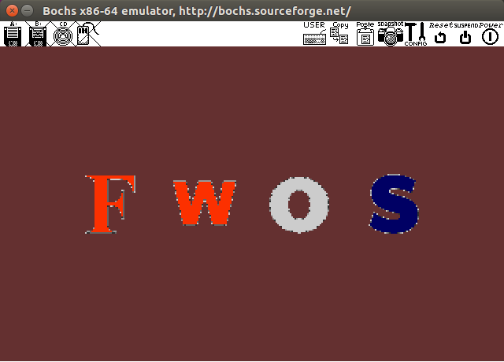
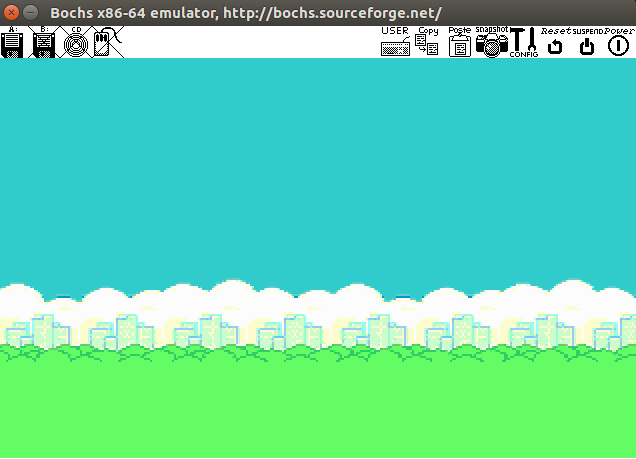
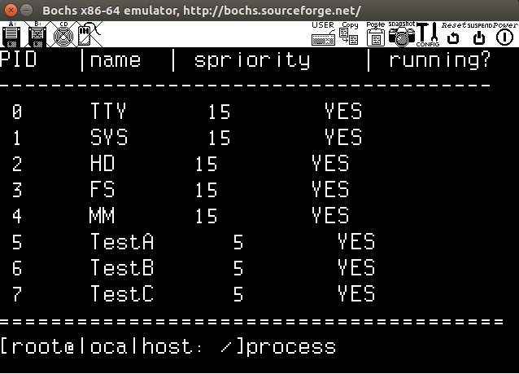
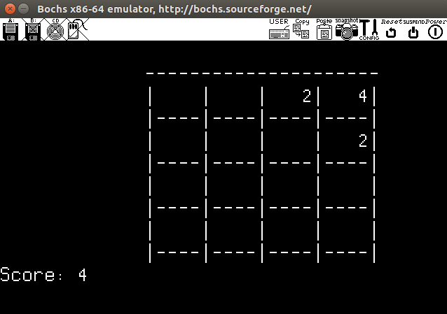
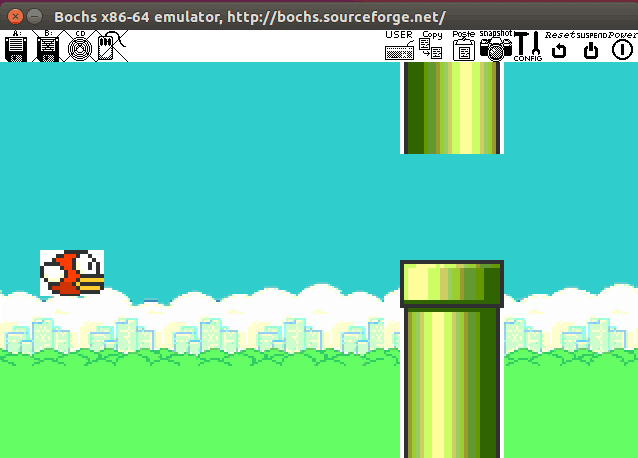

## 操作系统大项目——FWOS

小组成员：

欧阳桥梁 何立仁   周泓光   

### 1. 项目目的

​     通过操作系统课程设计，我们实现了一个简单而功能完善的操作系统，通过实践来理解一个操作系统的诞生。从而更加深入具体地了解操作系统的进程，内存，文件，以及外设管理的原理。

### 2. 开发环境

-  Ubuntu 16.04

- Bochs 模拟器

  

### 3. 项目完成指标

本次操作系统课程设计小组成员为3人，基于《Orange’s⼀个操作系统的实现》，通过修改或重新实现源码的一个或多个模块来实现一个简单得操作系统。

本次课程设计主要实现了图形化，对外设管理部分进行重新实现，实现了**B级**项目难度；同时对文件系统进行修改，支持多级文件系统，实现了**B级**难度；并实现了显示图片和保存图片等系统级应用，实现了**C级**难度；最后在图形化的基础上实现了一个图形化的小游戏，完成了**D级**难度

### 4. 效果展示

- 开机动画

   

 - 显示图片

   

   

- 进程管理

  

  

- 文件系统（支持基本文件操作，ls，cd，rm，mkdir，cat，vi .....）

  

- 游戏

  - 2048

    用户输入run2048可以进入2048游戏。系统⾃动打印游戏控制⽅法（wsad控制上下左右，enter键退出游戏）以及初始棋盘、当前分数（初始为0）；⽤户每次只能输⼊⼀个运动⽅向，系统⾃动刷新棋盘及分数，同时在棋盘内随机⽣成新数字格。

    

  - flappybird

    用户输入flappybird可以进入flappybird游戏。空格可以控制小鸟上升躲避障碍物。

    